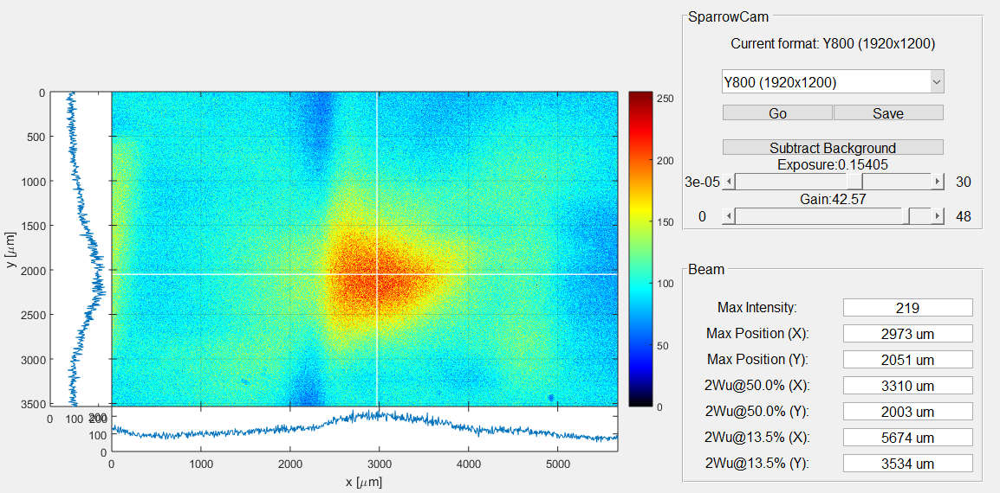

# SparrowCam

Laser beam profiler written in Matlab using image acquisition toolbox.

## Purpose

Measuring laser beams and its parameters like:

* Profile shape
* Size
* Finding focal position
* Interference paterns
* etc.

## Features

* Position of the maximum intensity in microns
* Crosshair at the maximum position
* FWHM of the beam
* ROI selection
* Sliders for exposure and gain
* Background difference
* Capturing
* Configurable parameters in ini file

## Requirements

* Matlab 2014 and higher
* Compatible camera (Program optimized for Imagingsource DMK 23UX174)

